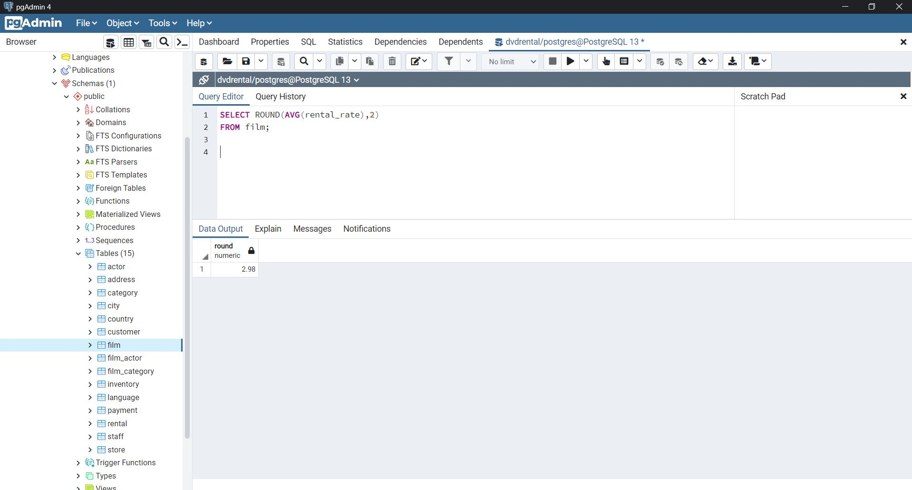
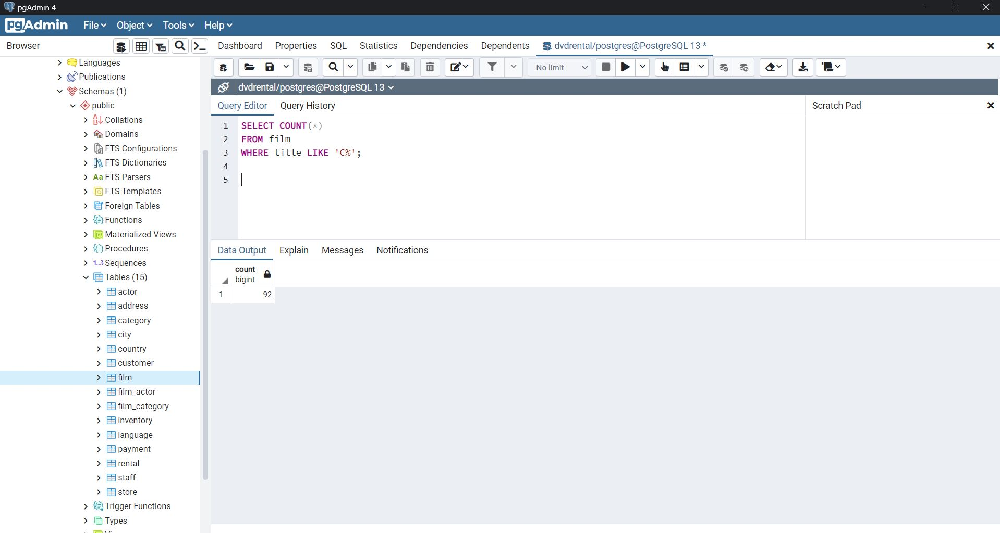
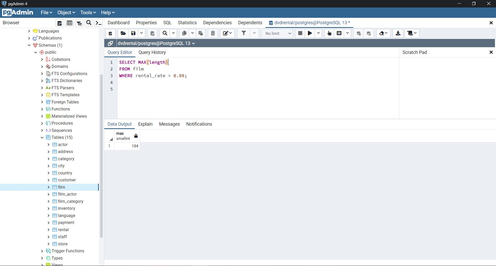

# SQL Ödev 6

## 1. Sorunun Cevabı 



```sql
SELECT ROUND(AVG(rental_rate),2)
FROM film;
```
## 2. Sorunun Cevabı 



```sql
SELECT COUNT(*)
FROM film
WHERE title LIKE 'C%';
```

## 3. Sorunun Cevabı 



```sql
SELECT MAX(length)
FROM film
WHERE rental_rate = 0.99;


```

## 4. Sorunun Cevabı 


```sql
SELECT COUNT(DISTINCT(rental_rate))
FROM film
WHERE length > 150;


```