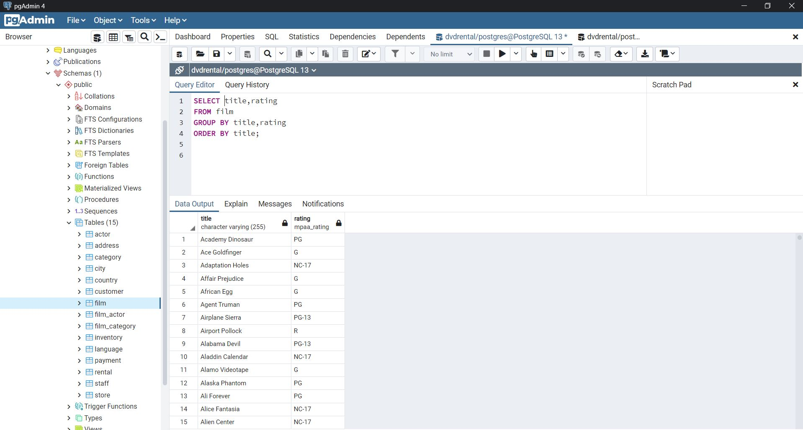
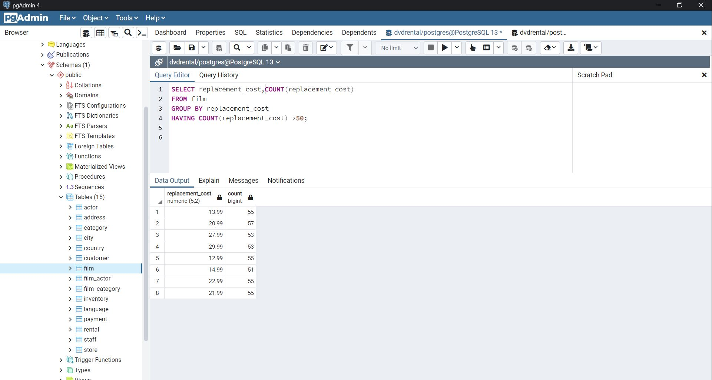
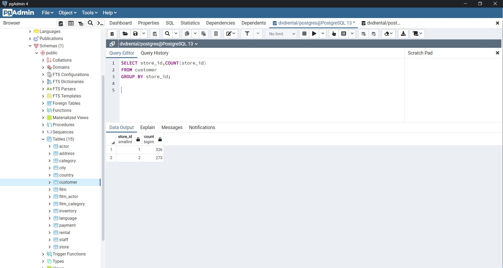
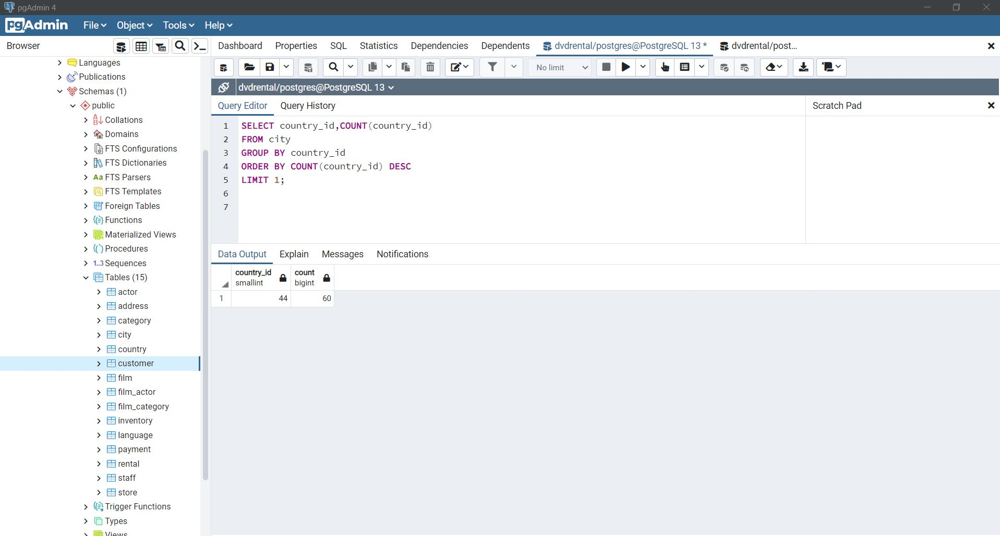

# SQL Ödev 7

## 1. Sorunun Cevabı 



```sql
SELECT title,rating
FROM film
GROUP BY title,rating
ORDER BY title;

```
## 2. Sorunun Cevabı 



```sql
SELECT replacement_cost,COUNT(replacement_cost)
FROM film
GROUP BY replacement_cost
HAVING COUNT(replacement_cost) >50;

```

## 3. Sorunun Cevabı 



```sql
SELECT store_id,COUNT(store_id)
FROM customer
GROUP BY store_id;


```

## 4. Sorunun Cevabı 



```sql
SELECT country_id,COUNT(country_id)
FROM city
GROUP BY country_id
ORDER BY COUNT(country_id) DESC
LIMIT 1;

```