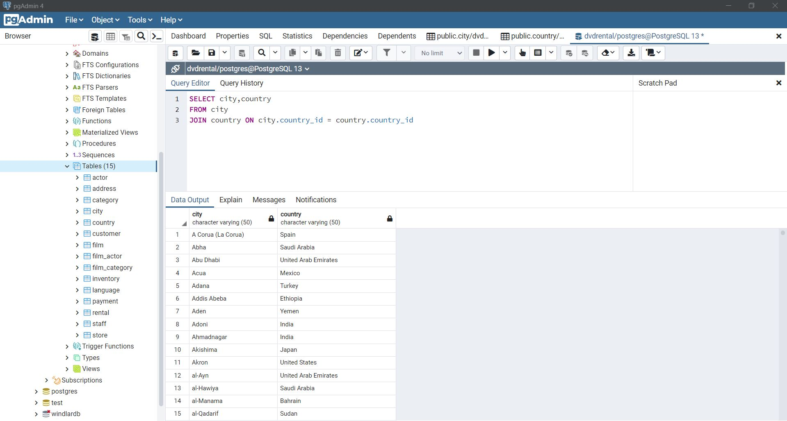
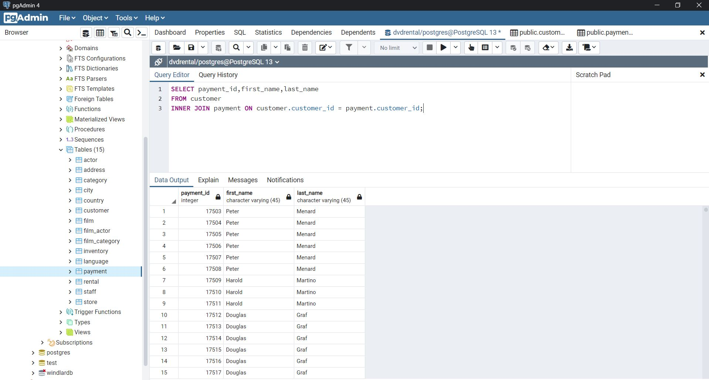
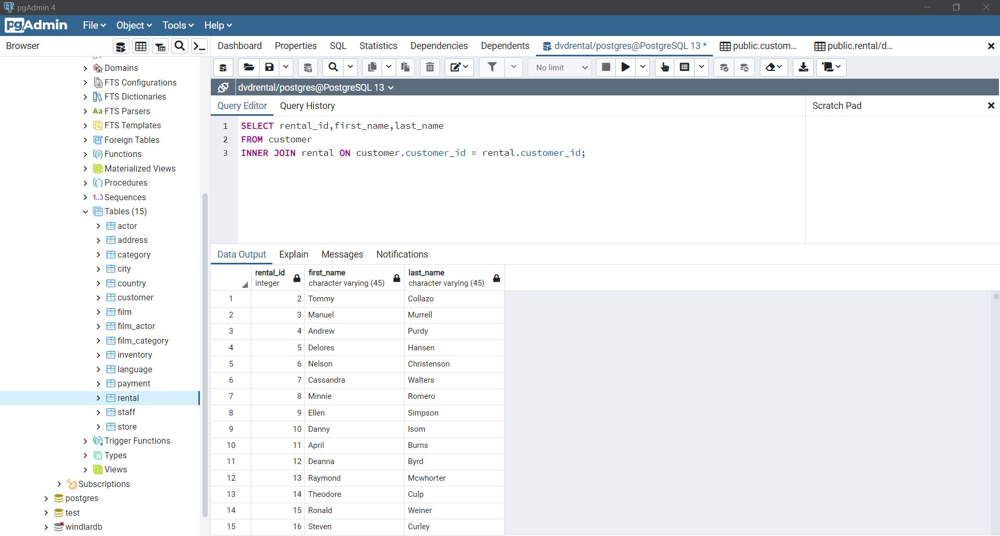

# SQL Ödev 9

## 1. Sorunun Cevabı 



```sql
SELECT city,country
FROM city
JOIN country ON city.country_id = country.country_id;

```
## 2. Sorunun Cevabı 



```sql
SELECT payment_id,first_name,last_name
FROM customer
INNER JOIN payment ON customer.customer_id = payment.customer_id;

```

## 3. Sorunun Cevabı 



```sql
SELECT rental_id,first_name,last_name
FROM customer
INNER JOIN rental ON customer.customer_id = rental.customer_id;

```
