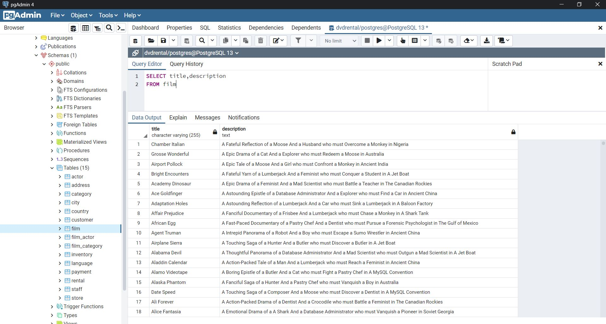
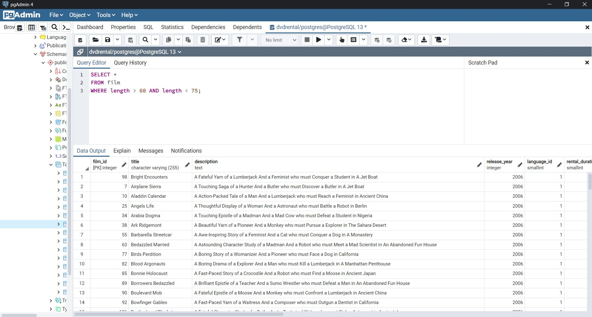
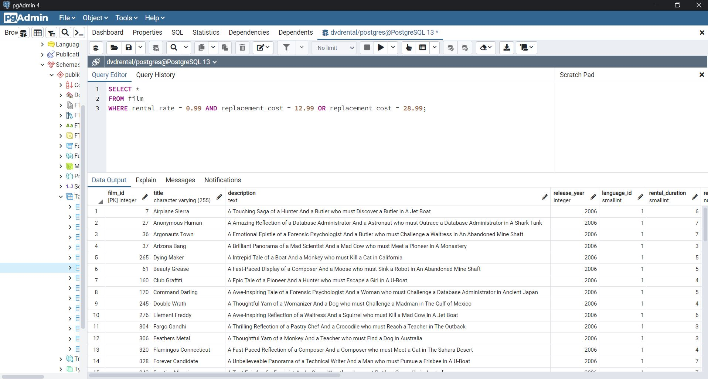
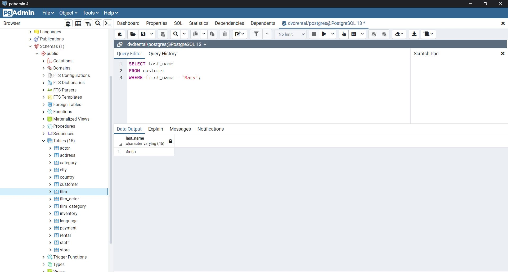
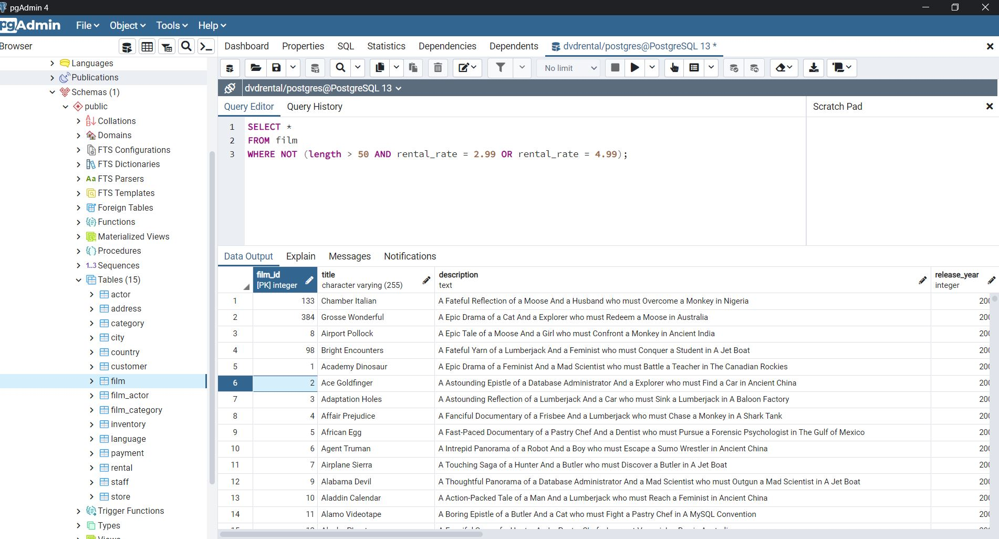

# SQL Ödev 1

## 1. Sorunun Cevabı 



```sql
SELECT title, description
FROM film
```
## 2. Sorunun Cevabı 



```sql
SELECT *
FROM film
WHERE length > 60 AND length < 75;
```

## 3. Sorunun Cevabı 



```sql
SELECT *
FROM film
WHERE rental_rate = 0.99 AND replacement_cost = 12.99 OR replacement_cost = 28.99;
```

## 4. Sorunun cevabı 



```sql
SELECT last_name
FROM customer
WHERE first_name = 'Mary';
```

## 5. Sorunun cevabı 



```sql
SELECT *
FROM film
WHERE NOT (length > 50 AND rental_rate = 2.99 OR rental_rate = 4.99);
```


