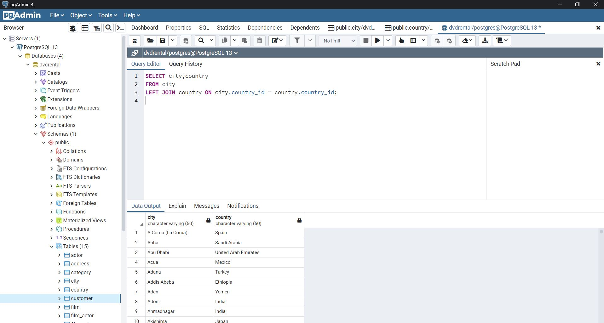
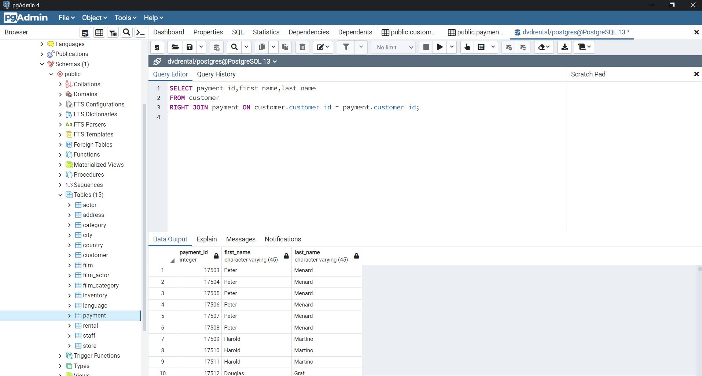
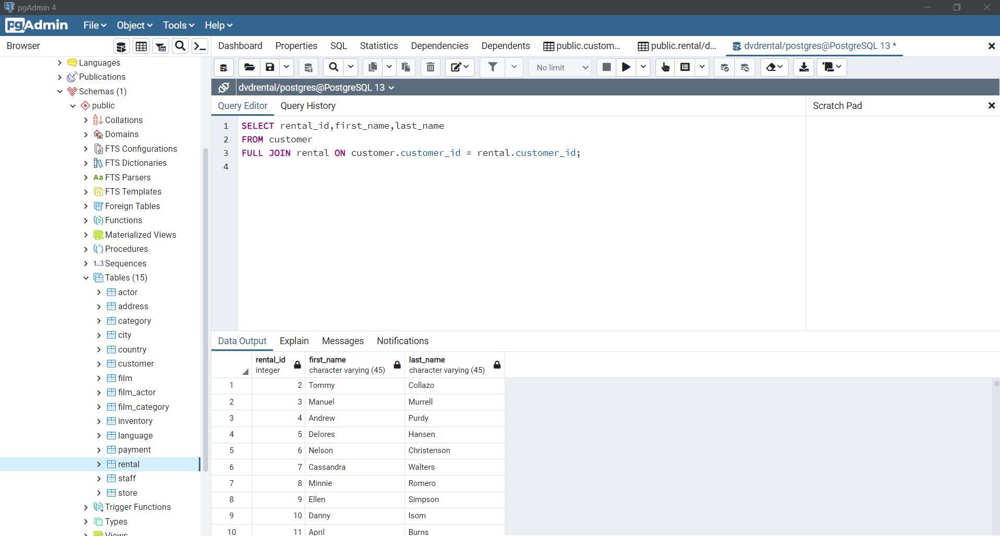

# SQL Ödev 10

## 1. Sorunun Cevabı 



```sql
SELECT city,country
FROM city
LEFT JOIN country ON city.country_id = country.country_id; 
```
## 2. Sorunun Cevabı 



```sql
SELECT payment_id,first_name,last_name
FROM customer
RIGHT JOIN payment ON customer.customer_id = payment.customer_id; 


```

## 3. Sorunun Cevabı 



```sql
SELECT rental_id,first_name,last_name
FROM customer
FULL JOIN rental ON customer.customer_id = rental.customer_id; 

```
