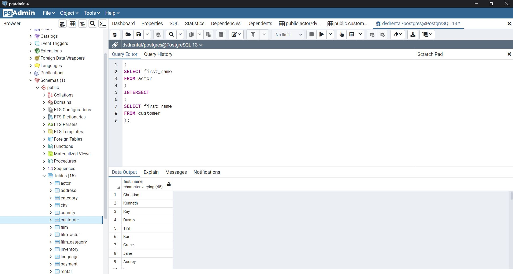
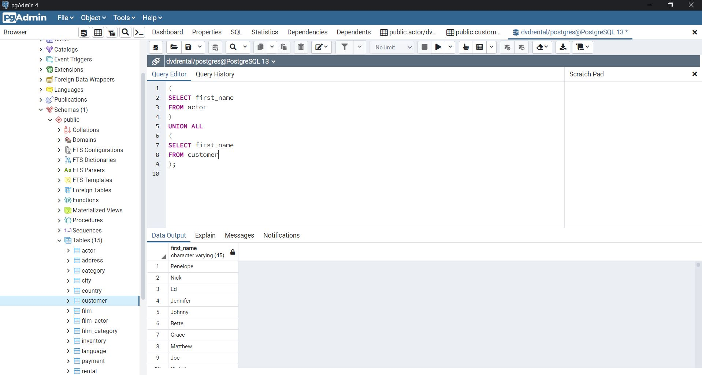

# SQL Ödev 11

## 1. Sorunun Cevabı 


```sql
(
SELECT first_name
FROM actor
)
UNION
(
SELECT first_name
FROM customer
);
```
## 2. Sorunun Cevabı 



```sql
(
SELECT first_name
FROM actor
)
INTERSECT
(
SELECT first_name
FROM customer
);


```

## 3. Sorunun Cevabı 


```sql
(
SELECT first_name
FROM actor
)
EXCEPT
(
SELECT first_name
FROM customer
);

```

## 4. Sorunun Cevabı 



```sql
(
SELECT first_name
FROM actor
)
UNION ALL
(
SELECT first_name
FROM customer
);

```


```sql
(
SELECT first_name
FROM actor
)
INTERSECT ALL
(
SELECT first_name
FROM customer
);

```


```sql
(
SELECT first_name
FROM actor
)
EXCEPT ALL
(
SELECT first_name
FROM customer
);

```