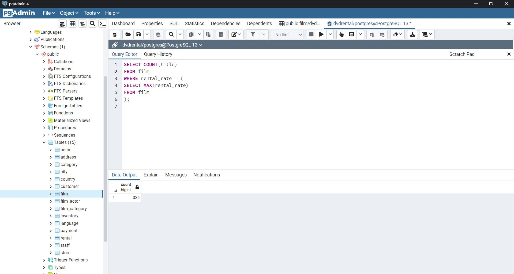
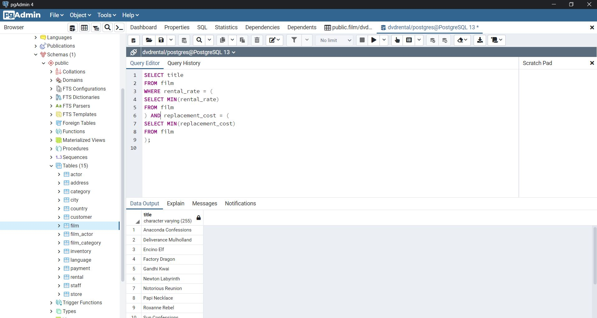
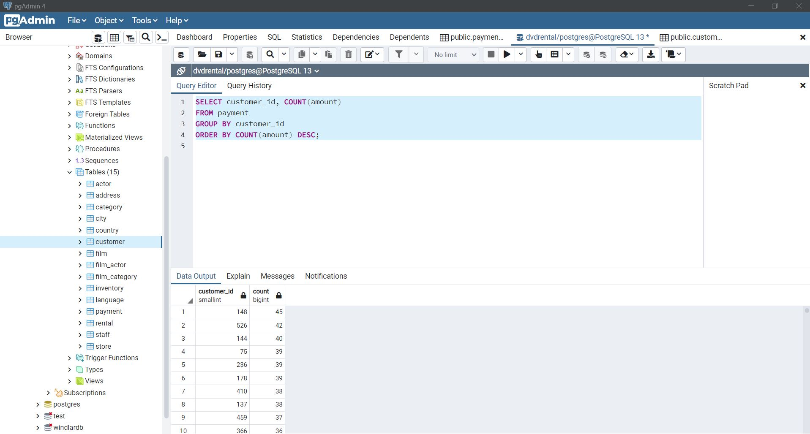

# SQL Ödev 12

## 1. Sorunun Cevabı 


```sql
SELECT COUNT(title)
FROM film
WHERE length > (
SELECT AVG(length)
FROM film
);

```
## 2. Sorunun Cevabı 



```sql
SELECT COUNT(title)
FROM film
WHERE rental_rate = (
SELECT MAX(rental_rate)
FROM film
);


```

## 3. Sorunun Cevabı 



```sql
SELECT title
FROM film
WHERE rental_rate = (
SELECT MIN(rental_rate)
FROM film
) AND replacement_cost = (
SELECT MIN(replacement_cost)
FROM film
);


```

## 4. Sorunun Cevabı 



```sql
SELECT customer_id, COUNT(amount) 
FROM payment
GROUP BY customer_id
ORDER BY COUNT(amount) DESC;


```