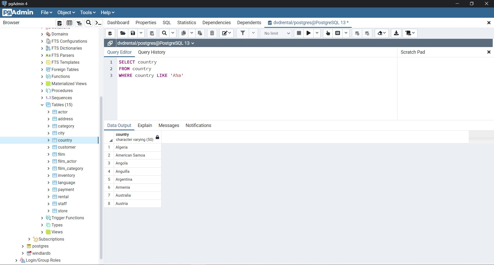
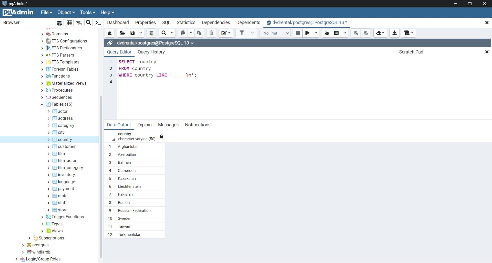
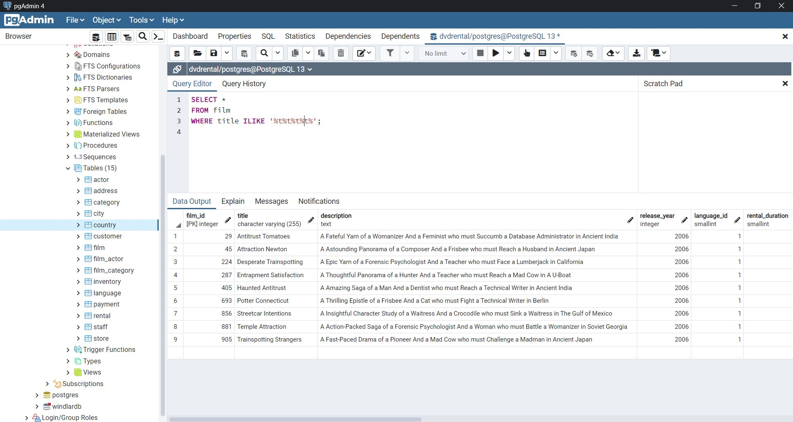
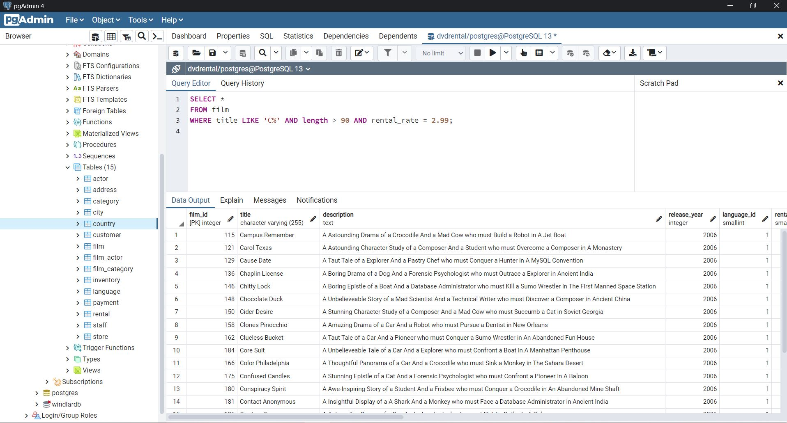

# SQL Ödev 3

## 1. Sorunun Cevabı 



```sql
SELECT country
FROM country
WHERE country LIKE 'A%a';
```
## 2. Sorunun Cevabı 



```sql
SELECT country
FROM country
WHERE country LIKE '_____%n';
```

## 3. Sorunun Cevabı 



```sql
SELECT *
FROM film
WHERE title ILIKE '%t%t%t%t%';

```

## 4. Sorunun Cevabı 



```sql
SELECT *
FROM film
WHERE title LIKE 'C%' AND length > 90 AND rental_rate = 2.99;
```