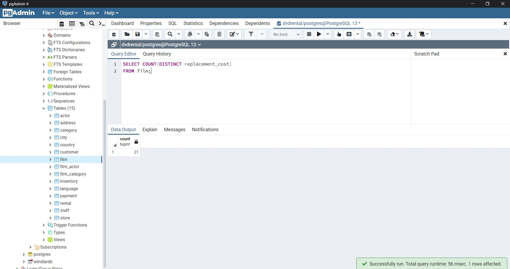

# SQL Ödev 4

## 1. Sorunun Cevabı 


```sql
SELECT DISTINCT replacement_cost 
FROM film;
```
## 2. Sorunun Cevabı 



```sql
SELECT COUNT(DISTINCT replacement_cost) 
FROM film;
```

## 3. Sorunun Cevabı 


```sql
SELECT COUNT(*) 
FROM film
WHERE title LIKE 'T%' AND rating = 'G';

```

## 4. Sorunun Cevabı 


```sql
SELECT COUNT(*) 
FROM country 
WHERE country LIKE '_____';
```

## 5. Sorunun Cevabı 


```sql
SELECT COUNT(*)
FROM city
WHERE city ILIKE '%r';
```