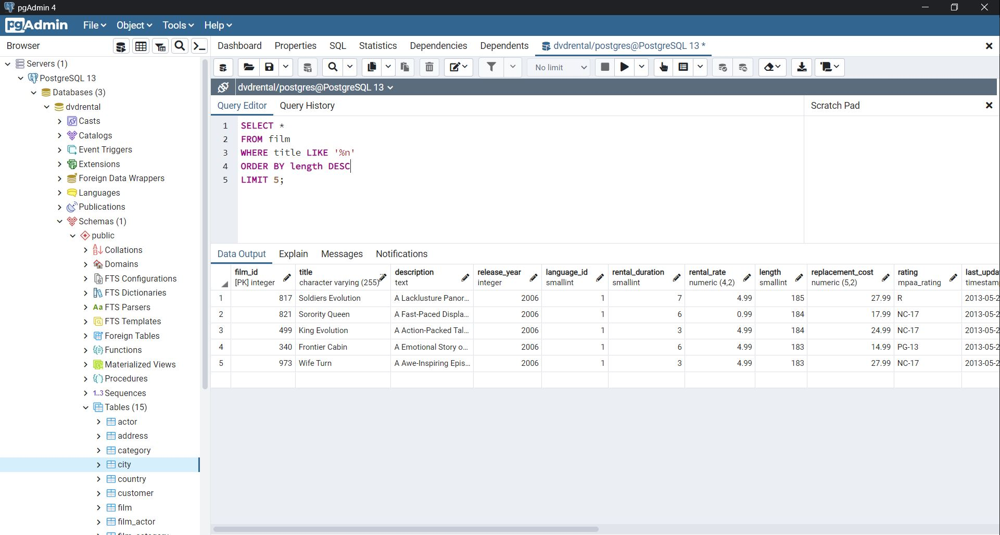
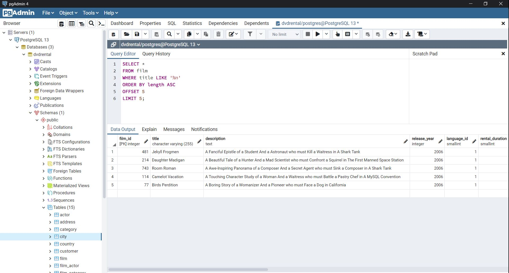
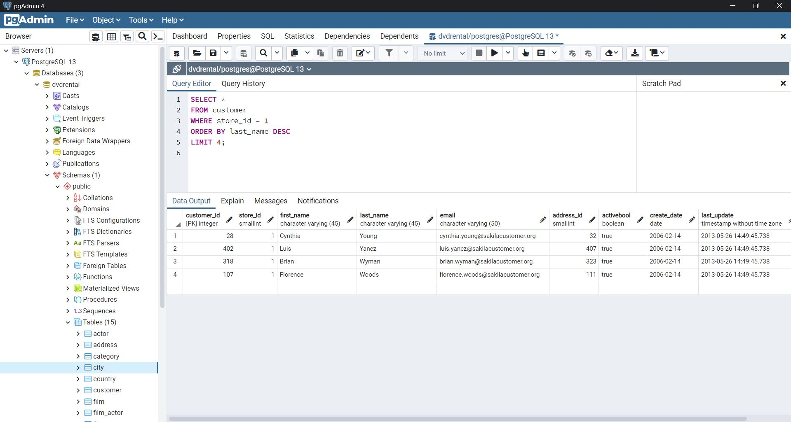

# SQL Ödev 5

## 1. Sorunun Cevabı 



```sql
SELECT * 
FROM film
WHERE title LIKE '%n' 
ORDER BY length DESC
LIMIT 5;
```
## 2. Sorunun Cevabı 



```sql
SELECT * 
FROM film
WHERE title LIKE '%n' 
ORDER BY length ASC
OFFSET 5
LIMIT 5;
```

## 3. Sorunun Cevabı 



```sql
SELECT * 
FROM customer
WHERE store_id = 1
ORDER BY last_name DESC
LIMIT 4;

```
